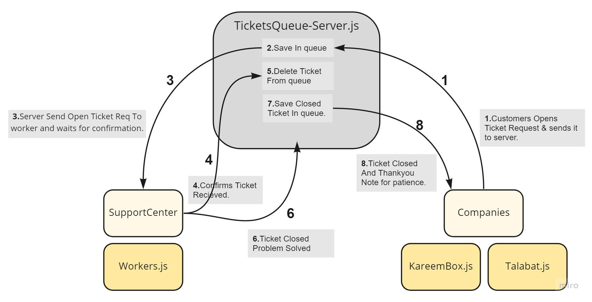
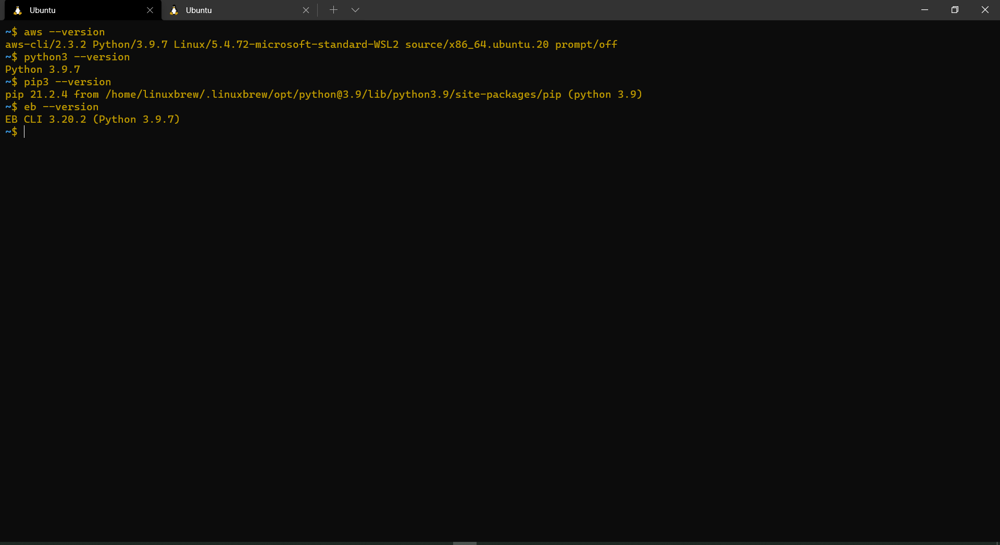

# cloud-server# LAB - 16
## Support Center 

### Author:
Sana Ishaqat

 ### **Group Organization Repo Links:**
- [Repo Link](https://github.com/SanaIshaqat/cloud-server)
- [PR-Link](https://github.com/SanaIshaqat/cloud-server/pull/2)

### **Event Driven Applications**

Create a new application using real-time events

Your team will be responsible for planning, executing, and presenting an application that showcases an event driven architecture

### **Requirements**

- Your application must employ the following programming concepts:

- A “hub” server that moderates all events.

- Multiple “clients” that connect to the hub which can both publish and subscribe to events.

- Must operate over a network
Optional:

- Engage an API that uses a database to store/retrieve information based on the events being triggered.

- Employ a standard “Queue” to ensure all messages are properly delivered.

- Employ a FIFO “Queue” to ensure ordered delivery of some events.

### **Project Ideas**

- A support/service center where customers place requests for help (tickets) and service workers assist and close tickets
- Works with several delivering companies and those companies clients can contact the support center through the server where tickets are in queue, to the support center workers to receive and handle open tickets and close them once problem is solved.

### **UML**

### **Terminal** 

#### Server Communications 

#### Installations

